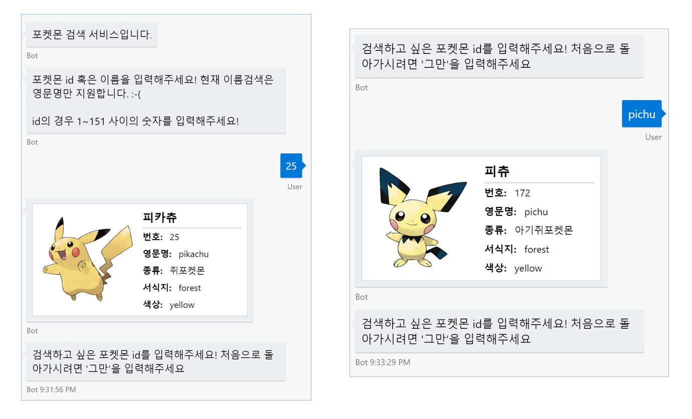
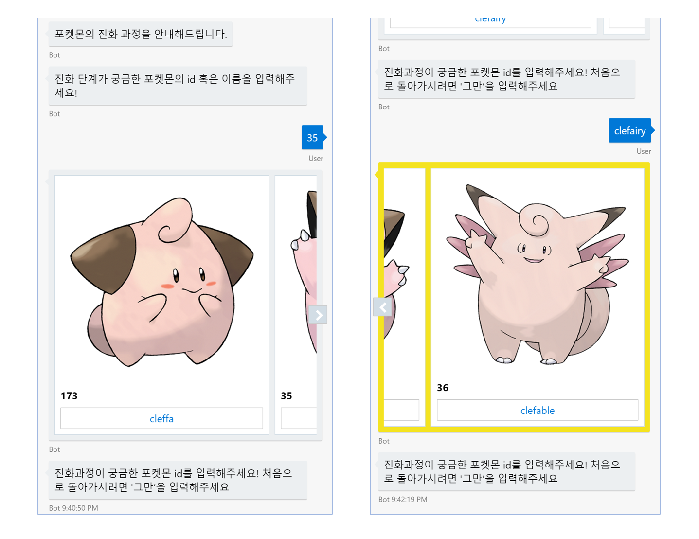
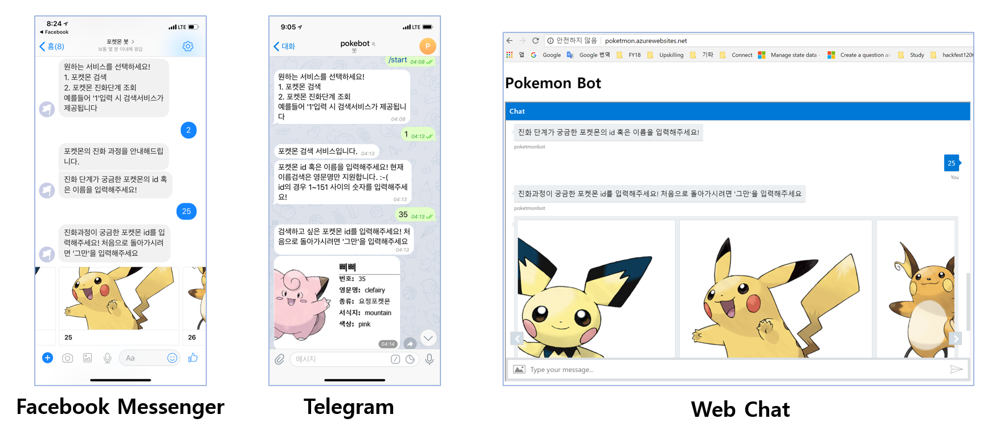
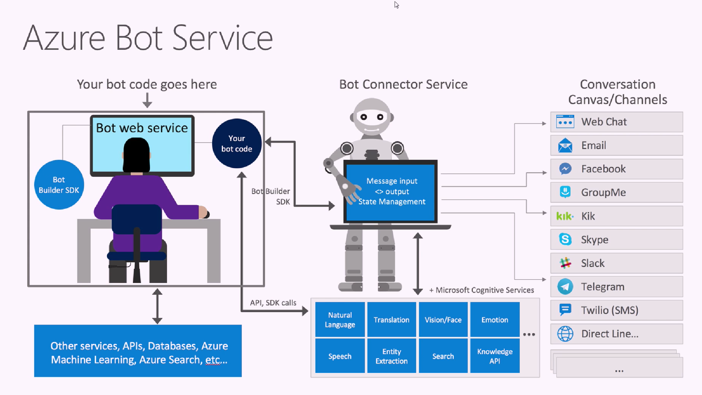
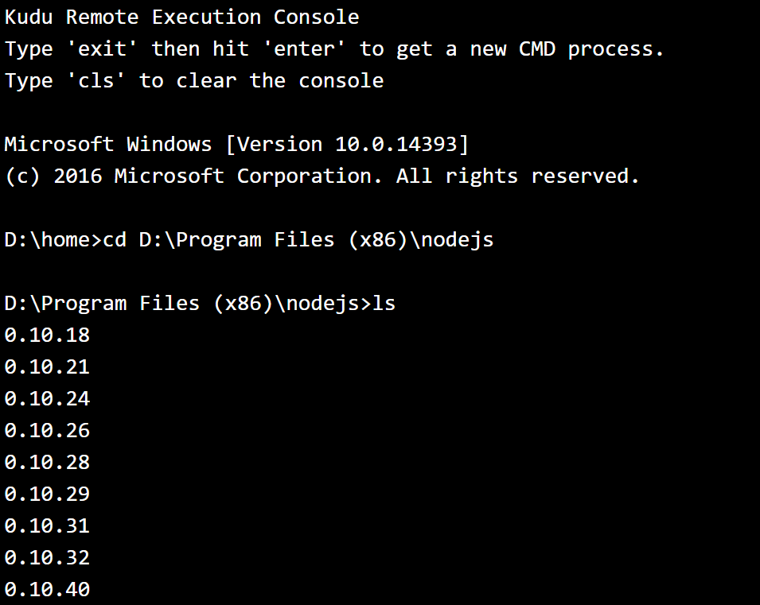
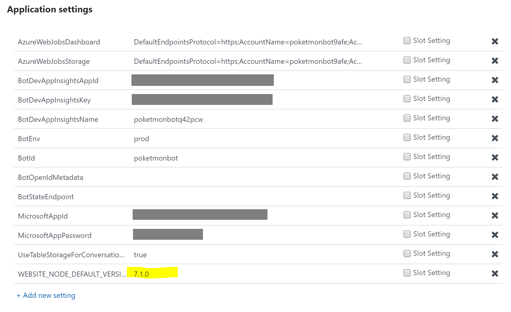
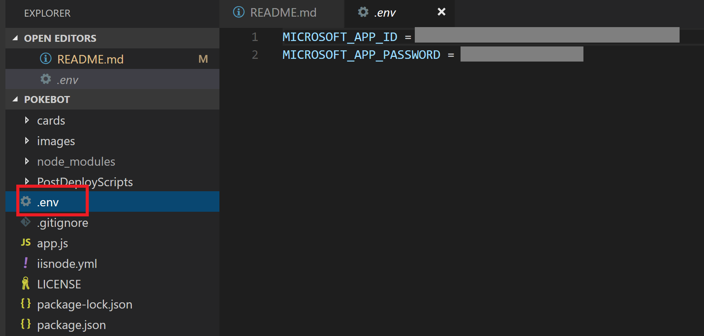
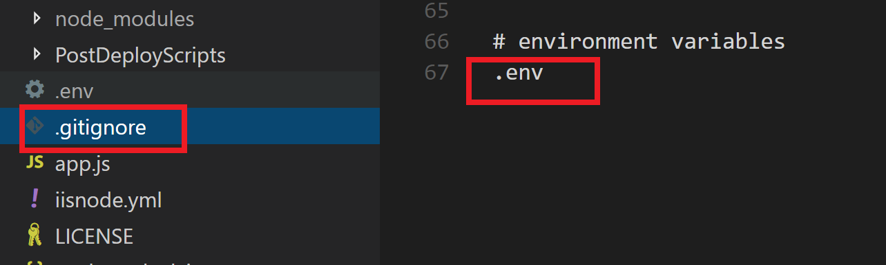
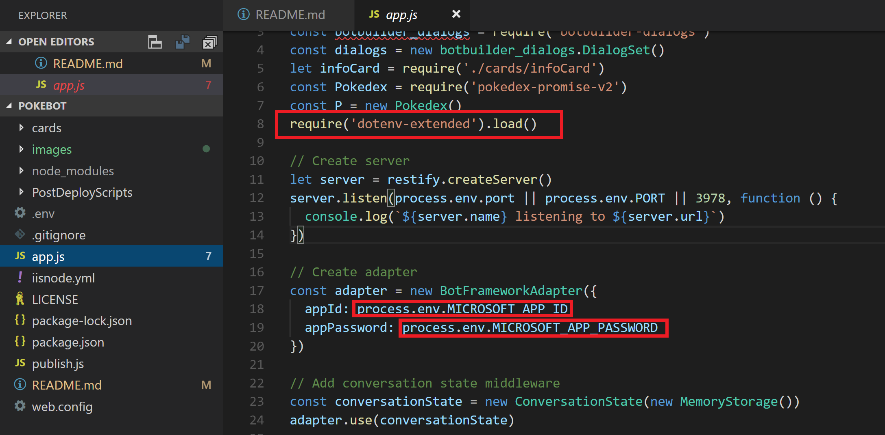

# pokebot
포켓몬 정보 및 진화과정을 알려주는 봇 입니다. 포켓몬 정보를 제공하는 [Pokeapi](https://pokeapi.co/)와 [Microsoft Bot Builder SDK v4 - Node.js](https://github.com/Microsoft/botbuilder-js)를 이용하여 만들었습니다. 

## 제공하는 기능 
1. 포켓몬 조회 
    
    : **포켓몬 id**(1~151 사이의 숫자) 혹은 **영문 이름**을 입력하면 포켓몬에 대한 상세 정보를 제공합니다. 

    

2. 진화과정 조회

    : **포켓몬 id**(1~151 사이의 숫자) 혹은 **영문 이름**을 입력하면 포켓몬 진화과정 정보를 보여줍니다.

    


## 사용방법
* STEP1. 원하는 서비스를 선택한다. (숫자 1 또는 2 입력)
* STEP2. 포켓몬 id (1~151) 또는 영문 이름을 입력한다.
* STEP3. 처음화면으로 돌아가고 싶은경우 '그만'을 입력한다. 

    

## Support Channel
* Facebook Messanger: 메신저 창에서 **포켓몬 봇** 검색
* Telegram: 연락처에서 **@poketmonbot** 검색
* Web Chat: [https://poketmon.azurewebsites.net/](https://poketmon.azurewebsites.net/) 접속

    

## Architecture

포켓몬 봇은 [Azure Bot Service](https://docs.microsoft.com/ko-kr/azure/bot-service/bot-service-overview-introduction?view=azure-bot-service-3.0)를 이용하여 개발하였습니다. Azure Bot Service란, Bot을 빠르고 편리하게 개발할 수 있는 서비스로 Bot을 개발하기 위한 템플릿코드와 함께 바로 사용가능한 봇이 Azure에 배포됩니다. 

* [Announcing General Availability of Azure Bot Service and Language Understanding service](https://channel9.msdn.com/Shows/AI-Show/Announcing-General-Availability-of-Azure-Bot-Service-and-Language-Understanding-service)

## Code Highlights

## Trouble Shooting
### Azure Web App - Default Node Version 변경
Azure Web App에서 기본으로 제공하는 Node Version은 6.9.1 입니다. Bot SDK v4 - Node.js에서 사용하는 몇가지 문법이 Node.js 버전7 이상을 설치해야 사용할 수 있습니다. Azure Web App에서 Default Node Version을 변경하는 방법은 다음과 같습니다. 

1. Azure Web App에서 지원하는 Node Version 확인

    Azure Portal의 App Service 관리화면에서 DEVELOPMENT TOOLS > Advanced Tools를 선택하여 접속할 수 있으며, 주소는 **https://<Azure App Service 이름>.scm.azurewebsites.net/** 입니다.
    상단의 메뉴에서 **Debug Console -> CMD**를 선택하여 명령 프롬프트를 오픈합니다. 그리고 다음의 명령어를 이용하여 사용가능한 nodejs 버전 목록을 확인합니다.

    ```
    cd D:\Program Files (x86)\nodejs
    ls
    ```

    

2. iisnode.yml 파일 변경 

    Azure Bot Service의 템플릿 코드에 함께 포함된 **iisnode.yml** 파일에 적혀있는 노드 버전을 1에서 제공하는 Node Version 중에서 내가 원하는 버전으로 변경합니다.
    포켓몬 봇에서는 7.1.0 버전을 사용하였으며 다음과 같이 파일 내용을 변경하였습니다. 

    ```
    nodeProcessCommandLine: "D:\Program Files (x86)\nodejs\7.1.0\node.exe"
    ``` 

3. Azure Web App의 Application Settings 값 변경

    Application Settings의 **WEBSITE_NODE_DEFAULT_VERSION**값을 2번에서 적어주었던 nodejs 버전과 동일한 버전으로 변경하고 저장후 Azure App Service를 다시 실행합니다.

    

4. 변경사항 확인

    1에서 사용했던 CMD 창에서 **node version** 명령어를 입력하면 현재 사용중인 node 버전을 확인할 수 있으며, 잘 변경되었는지 확인할 수 있습니다. 

### Environment Variable Support
AppId 및 AppPassword 와 같은 Credential 정보는 github같은 공개된 곳에 올리지 않기 위해 .env 파일과 같은 곳에 따로 저장해두고 사용합니다. 이 기능을 사용하기 위해서는 소스코드에 .env라는 파일을 새로 생성하시고, git ignore에 .env를 추가하시기 바랍니다. 

* .env 파일 생성 및 Credential 정보 입력

    

* gitignore에 .env 추가

    

* .env 를 이용하기 위한 npm 패키지 설치 및 소스코드에서 사용하기 위해 선언
    * 패키지 설치

        ```
        npm install --save dotenv-extended
        ```

    * 소스코드에서 선언 및 사용

        